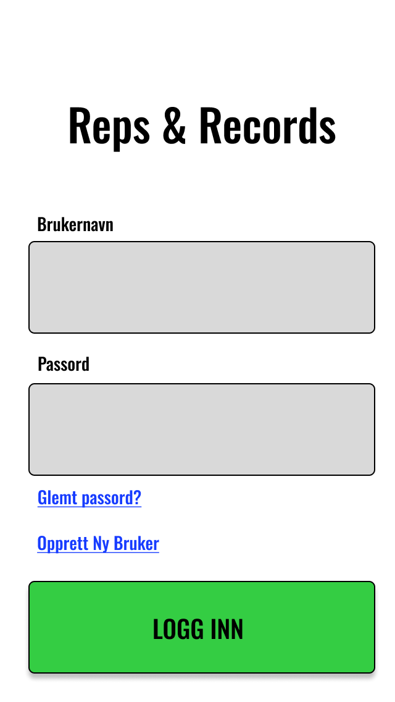
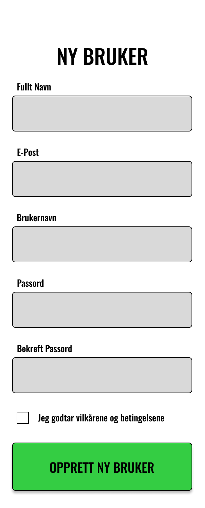
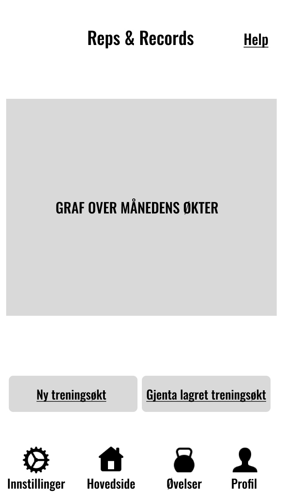
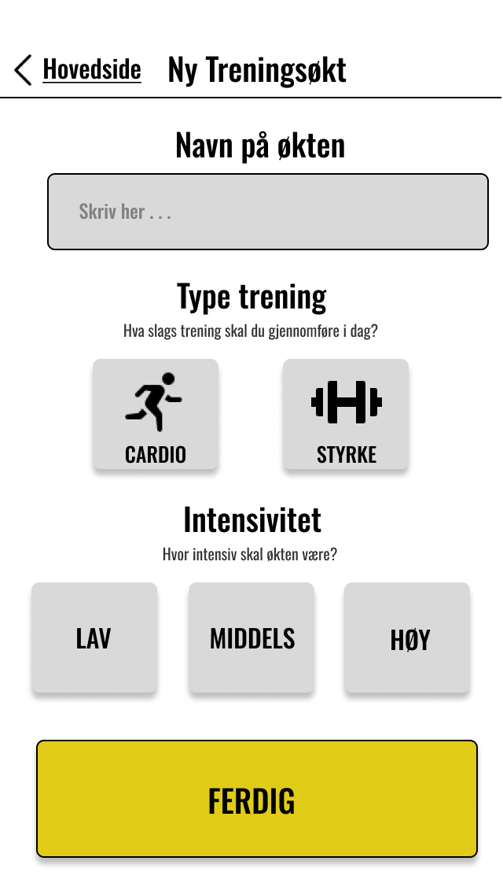
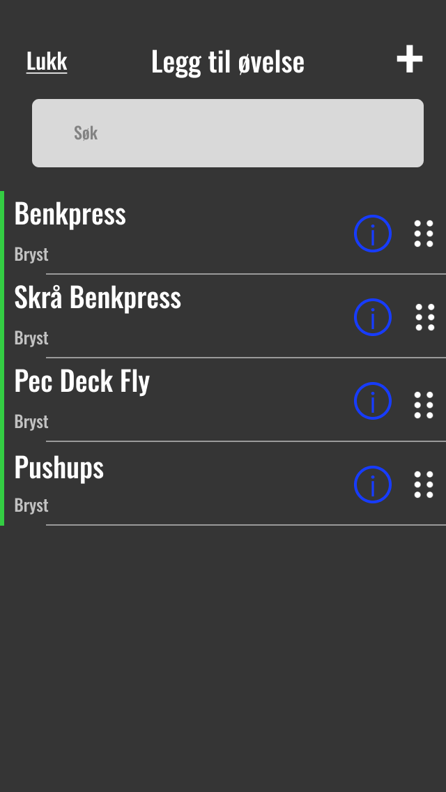
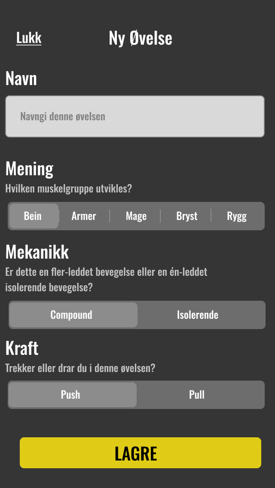
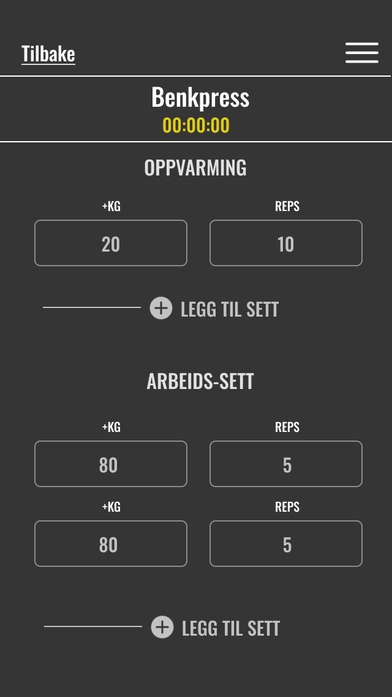

# Release 1

## Planning

Before starting implementing code to the project, we created Figma sheets for the different screens we wanted to include in our project. You can see some of the screens we created as inspiration underneath.

 

 

 

 

 

 

 

 

 

 

## Packages

### FXUI

The FXUI package is containing the frontend part of the application. Each fxml file has a connecting java file that represents one of the screens in the application. The pages has been outlined in figma for inspiration, but lookes a bit different in the actual application.

### Core

This folder contain all the business logic for out application. It contains the different classes we use to keep track of workout sessions for a user. It does contain a user class, a user manager and a usermanager listener to save and update workout sessions and exercises created and completed by the user.

It is also necessary to have classes for exercises and sets. An exercise is containing a name, purpose, mechanics and force. A Workout set is containing an exercise with belonging amount of repetitions and kg.

It is also created a class for validating if the passwords that the user is making for login.

### AI-tools

In this project, we have used AI tools as part of our development process, primarily for idea generation and to sparr for inspiration. AI was used in the following ways:

Idea Generation: We have used AI tools (mainly ChatGPT) to brainstorm and discuss various components of the application, such as the structure of data saving mechanisms, file formats (CSV and JSON), and the overall user workflow.

Sparring Partner for Problem Solving: Throughout the development process, AI served as a sparring partner to help clarify and validate ideas, especially when facing technical challenges, like with git problems. This provided additional perspectives on how to approach coding tasks, error debugging, and optimizing workflows.

### RESTAPI

This folder is for saving and loading data. When a user signs up in the application, it will create a User object from the core part, that contains a username, a password and an empty list of workouts. This is supposed to be saved to a csv file in the begininng, but to a JSON file later.

When a user is creating a new workout containing different exercises and sets, this will all be stored together with the user.

The file saving implementation is not yet finished, so it will not be possible to save and load data connected to a user, but that is the next step for implementation.