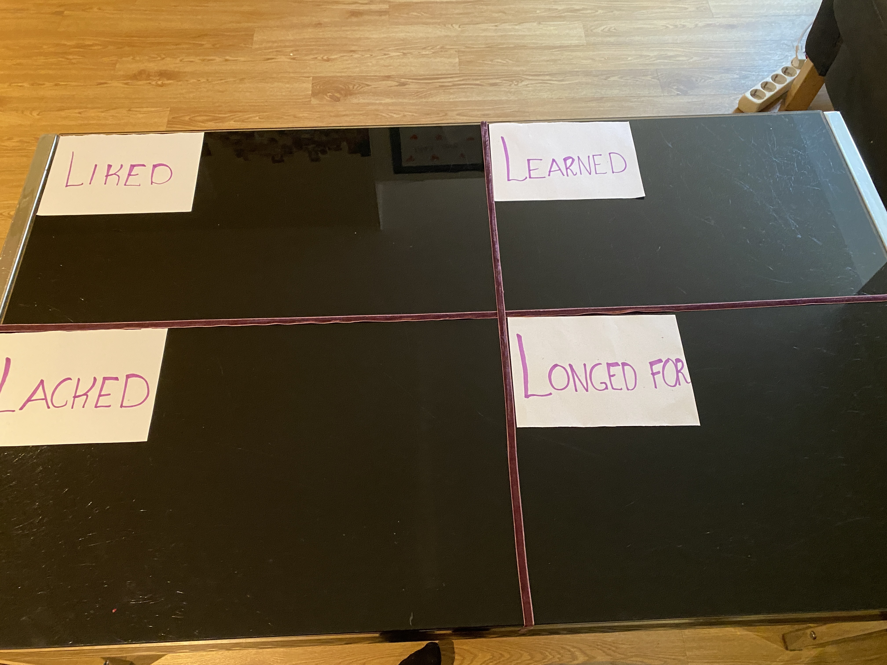
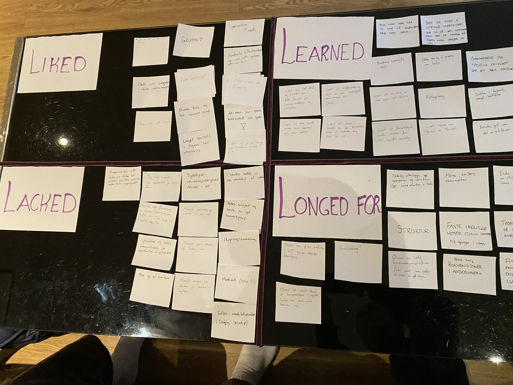
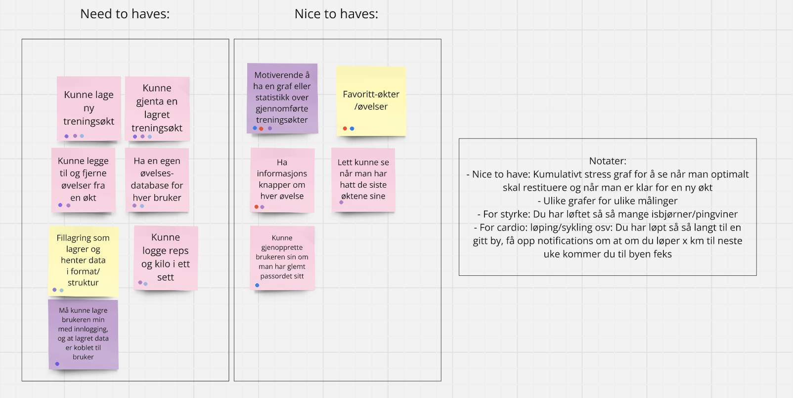
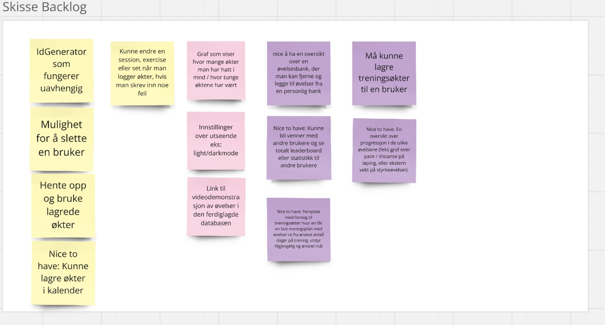
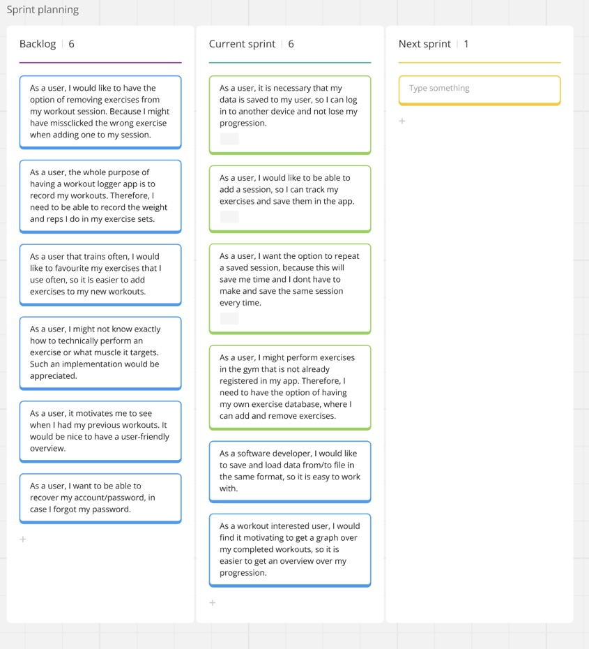

# Release 2

Since the first release, the team has implemented the following features:

- Complete JSON Serialization and Deserialization of all core objects.
- Functioning persistence coupled with FXML GUI.
- Finished implementing all core logic.
- Updated the FXML GUI to look more modern.
- Added all user story issues as functioning features in the app, such as:
      - Creating a new workout
      - Repeating an old workout (Automatically remove workout sets, but keep the exercises)
      - Creating a new user
      - Log into already made user
      - Add new exercises to the personal exercise database.

## Team development

Throughout the first release, the team figured out that the development happened a bit too quickly. It was difficult to have control over what spesific we were supposed to create, when it was expected done and who that was responsible for the implementation.  Therefore, after the first release, we decided to make and manage new issues toghether to have a more specified and well formulated issues to work with and introduced agile development to our working method.

We wanted to organize our development tasks to improve code quality and prevent technical debt, and decided to practice scrum (ish) methodology and introduce frequent use of git conventions.

## Scrum

We all agreed on that it is easier to stay creative, motivated and ask eachother for help if we enjoy each other's company, so we completed a retrospective - taco evening where we reflected about the first release. We divided a table into four quadrants and used the four L´s: Liked, learned, lacked, longed for to visualize progression. 

 

After reflecting over the last period, we created a common vision/goal for the application Reps&Records. The product goal is set to be:

**We want to make an application that record workout sessions, so a user can see progression, plan and keep track of exercises and workouts.**

Based on the goal, all of the team members had 5 minutes to write down individually the most important functionality that is nessecary for the application to be helpful. Here we wrote on post-it notes in [MIRO](https://miro.com/app/board/uXjVLakmumg=/).

With all of the notes in front of us, we all got 3 dods each to color the ideas that we thought were the most important ones for our application to have value with our product goal. The notes that got dots, were categorized as "need to haves" and prioritized from the most dots to less dots. A lot of this functionality were already implemented in release 1, and constituted out minimal viable product.

 After this first iteration, we did the same process once again. We chose new notes with important functionality - but not as crucial as the first ones. The ideas got prioritized in a decreasing order of dots, and got categorized as "nice to haves".

 

After writing individually, we discussed all of the ideas written down, and formulated them into user stories on the format:

**“As [a user persona], I want [to perform this action] so that [I can accomplish this goal].”**

 

Then we created a product backlog and chose the crucial ones to become a part of the next sprint with end 10. october 2024. These user stories is the foundation of the issueboard in GitLab. We decided that the green user stories in MIRO was the absolute minimum, but that we aimd for completing all of the user stories under "Current sprint". If tasks were completed, we agreed on focusing on formatting, testing and code quality rather than implementing more functionality.

## Git conventions

We agreed on creating issues connected to GitLab to have a visual vision board with tasks. Here we assign tasks to the person who is responsible for it, but we will cooperate on all of the tasks if it is hard to implement alone. We agreed on creating one dedicated branch for one user story, and not merge to main/master before someone else on the team has approved a merge request. This will hopefully make the developer more accountable for the code he/she has written, make all of the team members involved in others development parts and secure code assurance. 

We also agreed in using common code convensions and descriptive names to make it easier to work and navigate together when the application is growing. This also includes descriptive git commit messages. We stribe to use [these](https://gist.github.com/qoomon/5dfcdf8eec66a051ecd85625518cfd13?fbclid=IwZXh0bgNhZW0CMTEAAR2981w5AdyYMNffAT6yZHko91bYX8XAk2SlYapBRHNq-wzM-pK_aRkhxbM_aem_s4WhvfScl4FQvhnhYX-wlA) conventional commit message formats.

## Physical work sessions

In addition to better planning, we decided to have dedicated times with opportunity to pair and mob-program together. Therefore we book group rooms every monday and friday for working together. Here 10-12 is obligated, but we book room from 10-14, so we have the option to work together for longer. Here we organize the time to have a "daily standup" for maximum 15 minutes in the beginning of each session, where we both have a personal and technical recap with progress, plans and problems since last time we met. This is not because we think that someone is not working, but to capture difficulties continiously and strengthen ownership to the product and cohesion in the group.

## Slack

In the beginning of the project we used messenger and snapchat as communication channels. Both for work-life balance and organizition of information, links and reports, it is better to separate school from free time. Therefore we chose to create a slack workspace with different channels for the different purposes ad mentioned. Now, this is our main communication channel for the technical and practical in the project, while we still use messenger and snapchat for only social purposes.

## Qualiy assurance

## Test

Make it work, make it fast, make it pretty. Code quality is important, and we have a strong agreement that it we want to test as much as possible of the logic in the application. We stribe to have a high test coverage (desirable over 90%), especially in "core" - where the logic is. This is the most important part to test, but we will ensure to have ok coverage of the other parts of the project as well. We keep track of test coverage with Jacoco.

## Format

We have also integrated the project with checkstyle, where we use the google standards, to ensure that the standard in the project is good and the codebase is easier to read. Still, we found a couple of formatting improvement potentials in merge requests, and want to format the documents with the Java extension command "Format Document" if we got time before release 2 deadline. 

## Spotbugs

In addition to explicit tests, we have integrated our project with spotbugs to catch bugs and errors before we merge the changes to the project. We want spotbugs to ignore local self-comparisons and if representations or an internal fiels is exposed outside the class to focus on the real bugs in code. These exclusions is represented in the exclusion.xml file under "config".

## Diagrams

Class and sequence diagram made with PlantUML: 

