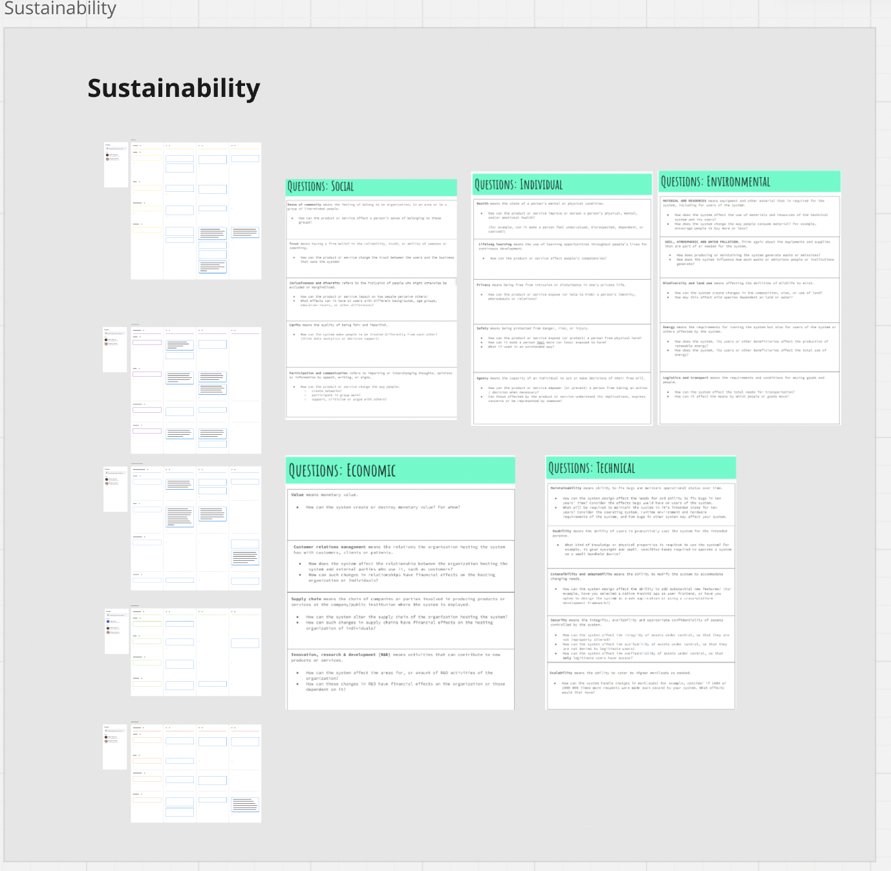
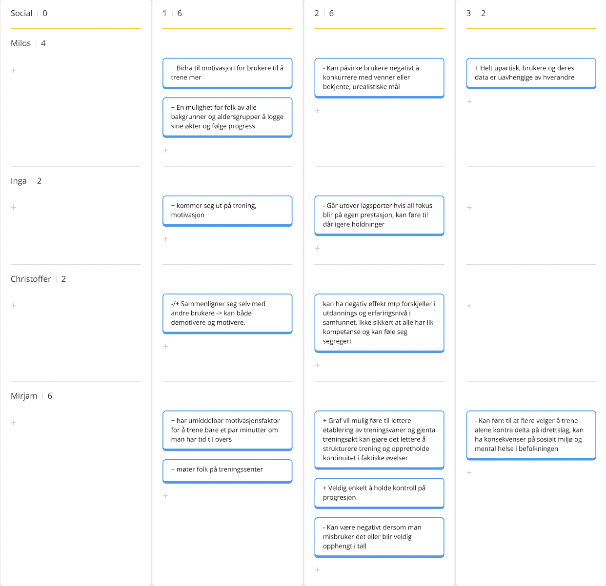
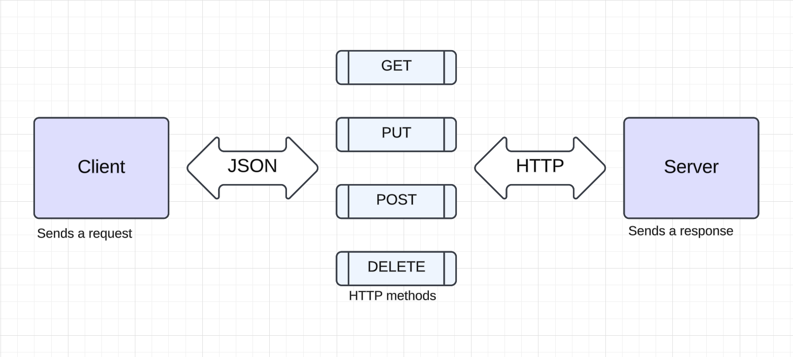

# Release 3

During the third release, our main focus has been to enable remote data storage instead of local storage on the client’s computer, using a server-client setup. We also implemented a graph to show the minutes a user has worked out over the last 30 days, aiming to motivate consistent gym attendance and establish healthy routines.

## Team development

The team has maintained the practices introduced earlier in development. We’ve held two meetings each week with daily standups, planned development tasks before coding, and worked to improve Git commit messages by linking them to their respective branches. Additionally, we’ve dedicated more of our weekly meeting time for pair programming. While pair programming requires more time, it significantly increases the learning experience. Pair programming is also a great way to perform code inspecton, that can increase the code quality.

## Code quality

Maintaining high code quality has been a priority throughout this release. To support this, we provided more constructive feedback in code reviews and merge requests, helping us not only review each other’s code for quality but also stay updated on small changes that improve readability and structure. We have of course also continued with practices introduced during release 1 and 2 such as Scrum and Git conventions and strive for a high test coverage. 

We have primarily used MIRO for sprint planning and retrospectives in this project, and this release was no exception. During the third release, we also held a workshop on sustainability and project challenges, conducted in MIRO. For each dimension of sustainability, group members spent three minutes reflecting individually before sharing and discussing insights as a group. We repeated this approach for identifying challenges, and the team showed strong alignment on both sustainability aspects and development process challenges. The pictures underneath shows an insight into the process of gaining reflections around the sustainability aspects of the Reps&Records application.

 
=======
### RESTful Architecture

For our third release, the focus was on enabling remote data storage via a server-client setup rather than local storage on the user’s device. This change allows users to access their data across multiple devices. The REST API specifies endpoints, methods, and status codes, defining how the client/user interface interacts with the server over HTTP. For instance, the endpoint api/users/{name} allows the client to `PUT`, `POST`, `GET`, or `DELETE` workout sessions or exercises in a personalized database for the user specified by {name}.

The REST server hosts the REST API and is responsible for processing client requests and returning appropriate responses according to the API logic and HTTP specifications. Responses are sent back to the client in JSON format, containing both the data and relevant status codes. Below is a diagram illustrating this setup created in lucidchart.

The format that requests supported is JSON, and an example of a response for a new user can be inspected in app/restserver/src/test/resources/restserver-users-test.json.

### Postman

To ensure our client and server communicates correctly through the HTTP requests, we have used Postman to check the status codes recieved from the requests. We have tested all of the validated endpoints, and gets the status codes 200 for `GET` and `PUT`, 201 for `POST` and 204 for `DELETE` requests.

### Frontend choice

This release emphasized code quality over new features to reduce technical debt. We actively used SpotBugs and Checkstyle to maintain code clarity and catch potential bugs. We also decided to continue using JavaFX rather than switching to another UI framework like React, SwiftUI, or Kotlin. The team concluded it was better to focus on delivering a high-quality, functional application than to spend time learning a new technology.

### New feature

Because we chose to stick to JavaFX, we have implemented a new feature in to the application. From the product backlog we created early in the project, we wanted to prioritize the user story: **"As a workout interested user, I would find it motivating to get a graph over my completed workouts, so it is easier to get an overview over my progression"**. During this release, we have implemented a graph that is placed in the middle of the home screen to increase motivation. For every workout session that is completed in the application, there will be a red vertical line that represents the amount of minutes used. The graph gives an overview over the last 30 days of tracked workouts. This will hopefully make it easier to establish healthy routines that directly or indirectly impacts the [sustainability](.docs/release3/sustainability.md) dimentions. 

### Team development

The team has maintained the practices introduced earlier in development. We’ve held two meetings each week with daily standups, planned development tasks from user stories before coding, and worked to improve Git commit messages by linking them to their respective branches. Additionally, we’ve dedicated more of our weekly meeting time for pair programming. While pair programming requires more time, it significantly increases the learning experience. Pair programming is also a great way to perform code inspecton, that can increase the code quality.

### Code quality

Maintaining high code quality has been a priority throughout this release. To support this, we provided more constructive feedback in code reviews and merge requests, helping us not only review each other’s code for quality but also stay updated on small changes that improve readability and structure for further development. We have of course also continued stribing for a high precentage of test coverage.

In release 2, we also implemented spotbugs and checkstyle to improve the quality. Throughut this release we have focused on removing as much checkstyle violations as possible to make our code more readable due to the google convention.

### Workshops

We have primarily used MIRO for sprint planning and retrospectives in this project, and this release was no exception. During the third release, we also held a workshop on sustainability and project challenges, conducted in MIRO. For each dimension of sustainability, group members spent three minutes reflecting individually before sharing and discussing insights as a group. We repeated this approach for identifying challenges, and the team showed strong alignment on both sustainability aspects and development process challenges. The pictures underneath shows an insight into the process of gaining reflections around the sustainability aspects of the Reps&Records application.

 

### Diagrams

Class, Sequence and package diagram for Reps&Records made with PlantUml is shown underneath.

**Class diagram**

**Sequence diagram**

**Package diagram**
