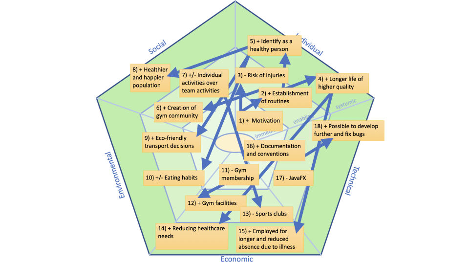

# Sustainability

Reps&Records is an application designed to help users organize workout sessions, establish routines, boost motivation, and simplify workout planning. While its primary impact lies in the individual sustainability dimension, it also creates positive ripple effects across social and economic dimensions.

The application is primarily a tool to increase users' motivation to work out. For users who are not yet exercising regularly, Reps&Records can facilitate a structured plan for gym sessions, which can lead to self-improvement, a sense of mastery, and improved immune function. This increase in physical activity may help users feel more energized and productive, potentially leading to healthier, longer lives. If the application encourages more people to work out regularly, it can contribute to reducing lifestyle diseases, which are often related to sedentary habits associated with modern technology use. In this way, Reps&Records can support a healthier, happier population, ultimately reducing healthcare needs and absence from work due to illness. This has primarily an individual impact, but has also positive social and economic ripple effects.

If users establish a consistent workout routine, they may also develop a sense of community at the gym, which enhances social interactions and promotes a supportive environment. However, it's worth noting that a shift towards individual fitness could potentially reduce interest in team sports, impacting sports clubs socially and financially. For some individuals, this may also mean fewer opportunities to develop teamwork skills, which are fostered in team sports.

Since Reps&Records primarily supports gym-based activities that require equipment, it has a positive economic and social impact on fitness centers, which can improve facilities and broaden their offerings for members. Our goal is to make the application freely available to users to reduce barriers related to socioeconomic status. Nonetheless, gym access requires a membership fee, which could limit the applications accessibility for users who cannot afford it.

In terms of environmental impact, the application itself has minimal direct effects. It does not require large electricity and storage resources. However, exercise habits can indirectly influence users’ lifestyle choices. For instance, users who work out regularly may see themselves as health-conscious individuals and be more likely to make eco-friendly decisions, like walking or biking short distances instead of driving, or taking the stairs over an elevator. Fitness habits also often influence dietary choices, which can have variable environmental impacts. Some users may choose a more plant-based or local diet, which tends to have a lower environmental footprint, while others might increase their meat consumption to meet protein needs for training, which has a higher environmental cost.

However, the applications' motivational aspect does come with potential downsides. Overtraining is a risk, especially if users are driven to exceed healthy limits based on their tracked data. Without proper technique or rest, some may experience injuries or even develop unhealthy relationships with exercise or food.

From a technical perspective, we have committed to maintaining a clean and well-documented codebase, adhering to common conventions for both code structure and Git practices. We’ve integrated tools like SpotBugs and Checkstyle and thoroughly tested our code to minimize technical debt, facilitate collaboration, future development and bug fixing. Although the application currently uses JavaFX, the flexible codebase allows for easy updates, including a potential migration to native user interface frameworks like React Native, SwiftUI, or Kotlin in the future.

 

 
